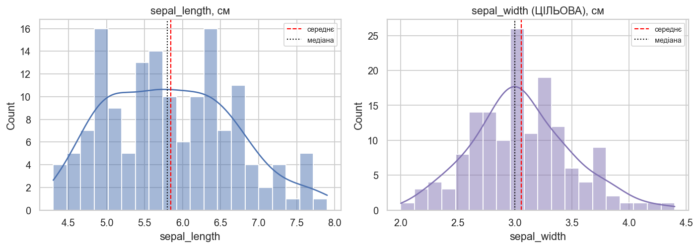
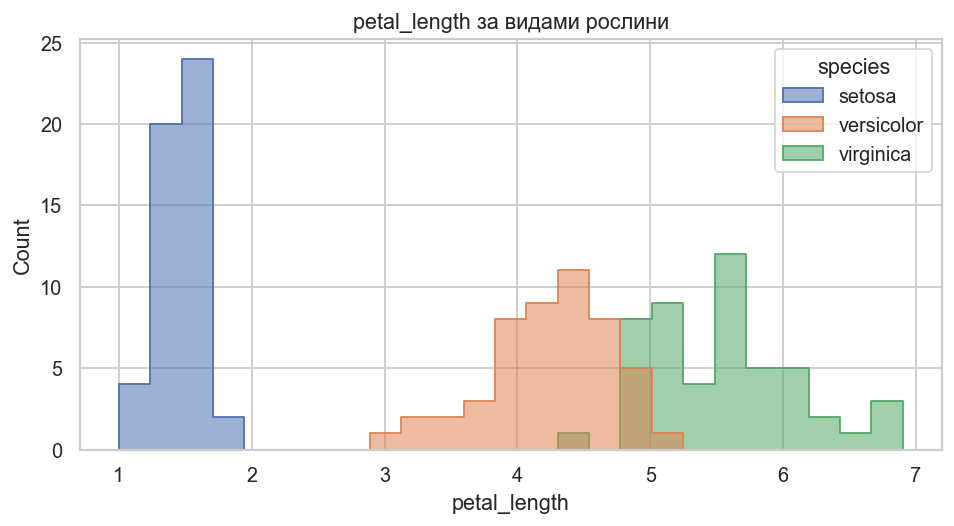
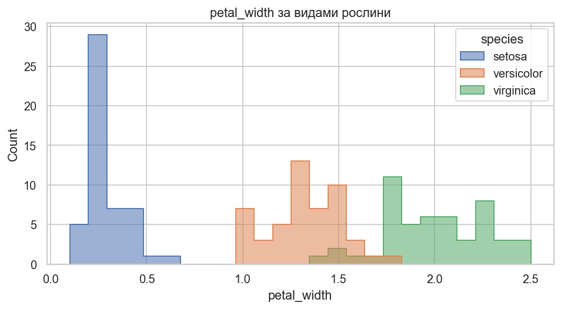
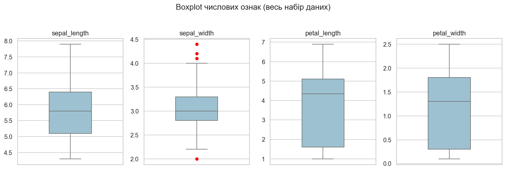
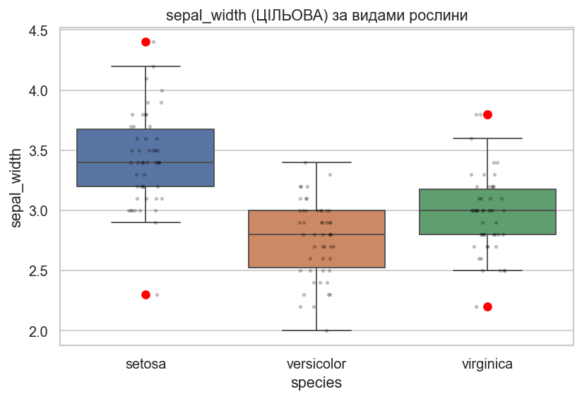
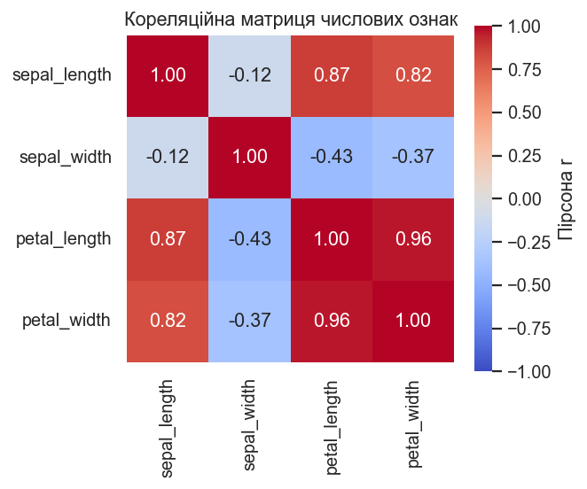
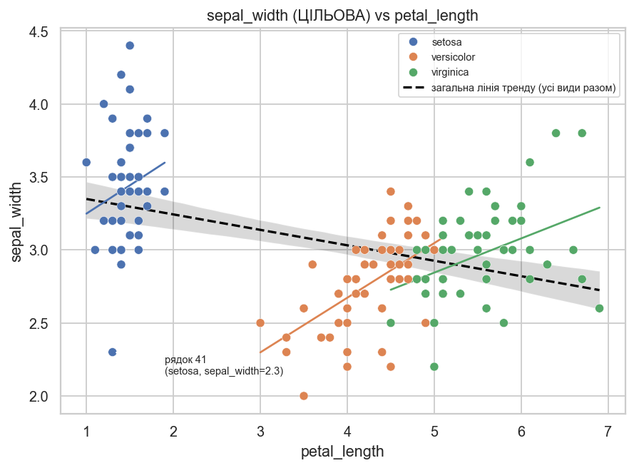

# Лабораторна/практична робота 1. Формулювання задачі, первинний аудит та аналіз ознак

**Набір даних:** Iris (індивідуальний варіант — цільова ознака `sepal width`)
**Дисципліна:** Машинне навчання
**Виконав(ла):** Воловник Я
**Група:** ІПЗ-23

> На цьому етапі модель **ще не будується**. Мета роботи — зрозуміти структуру та якість даних і підготувати їх до подальшого використання. Мету цієї практичної роботи (аудит і формулювання задачі) слід чітко відрізняти від мети майбутнього моделювання (побудова регресійної моделі).

---

## 1. Тема та мета роботи

**Тема:** формулювання задачі машинного навчання та первинний аудит індивідуального набору даних Iris із цільовою ознакою `sepal width`.

**Мета:** ознайомитися з індивідуальним набором даних, визначити його структуру, тип майбутньої задачі та практичний зміст прогнозування, а також провести первинний аудит якості даних (розмірність, типи, пропуски, дублікати, службові ознаки) для підготовки до подальшого аналізу.

## 2. Постановка задачі

Використовується класичний набір даних Iris, у якому за умовою індивідуального варіанта цільовою змінною є **`sepal width`** (ширина чашолистка) — неперервна кількісна ознака. Отже, замість класичної задачі класифікації виду рослини (`species`), розглядається задача **регресії**: прогнозування ширини чашолистка за іншими вимірюваними характеристиками квітки (довжина чашолистка, довжина та ширина пелюстки) і видом рослини.

Практичний зміст: пряме вимірювання ширини чашолистка може бути ускладнене (нерегулярна форма, пошкодження зразка), тоді як інші вимірювання зробити простіше. Модель, що оцінює `sepal width` за рештою ознак, дозволяє отримати цю характеристику непрямим шляхом.

Детальні відповіді на всі пункти формулювання задачі (джерело даних, предметна область, об'єкти таблиці, кількість об'єктів і ознак, цільова змінна, тип задачі, практичний зміст) наведено в ноутбуці `notebook/lab01.ipynb`, розділ 1.

## 3. Опис даних

- **Джерело:** Iris Data Set, UCI Machine Learning Repository (https://archive.ics.uci.edu/dataset/53/iris); завантажується локально через `sklearn.datasets.load_iris`, без потреби у зовнішньому файлі даних.
- **Об'єкти (рядки):** окремі квітки ірису трьох видів — *Iris setosa*, *Iris versicolor*, *Iris virginica*.
- **Розмір:** 150 об'єктів, 5 стовпців (4 числові морфометричні ознаки + 1 категоріальна ознака виду рослини).
- **Ознаки:** `sepal_length`, `sepal_width`, `petal_length`, `petal_width` (см, `float64`), `species` (категоріальна, 3 значення, збалансовано по 50 об'єктів кожного класу).
- **Цільова змінна:** `sepal_width`.

### Результати первинного аудиту

| Перевірка | Результат |
|---|---|
| Розмірність (`df.shape`) | 150 рядків × 5 стовпців |
| Формальні типи (`df.dtypes`) | 4 × `float64`, 1 × текстовий (`species`) |
| Унікальні значення (`df.nunique()`) | sepal_length: 35, sepal_width: 23, petal_length: 43, petal_width: 22, species: 3 |
| Пропущені значення (`df.isnull().sum()`) | 0 у кожному стовпці (0.0%) |
| Повні дублікати (`df.duplicated().sum()`) | 1 (рядки з індексами 101 і 142, обидва `virginica`) |
| Службові / ID-ознаки | Відсутні; `species` — змістовна ознака (колишня ціль класифікації), а не службова |
| Баланс класів `species` | Збалансовано: 50 / 50 / 50 |

**Виявлені потенційні проблеми:**
1. Один повний дублікат рядка — рішення щодо видалення слід прийняти на етапі підготовки даних до моделювання.
2. `species` — категоріальна ознака без природного порядку, потребуватиме one-hot кодування (не нумерації) для використання в регресійних моделях.
3. `sepal_width` містить статистичні викиди як на глобальному рівні (4 точки), так і додаткові — на рівні окремих видів; жоден не видалено (детально — розділ "Пошук аномалій").
4. `petal_length` і `petal_width` мають виражену "двогорбу" структуру розподілу через змішування трьох видів.
5. `sepal_width` (ціль) демонструє **парадокс Сімпсона** у зв'язку з `petal_length`/`petal_width`: від'ємна кореляція на рівні вибірки, додатна — в межах кожного виду. Це означає, що `species` необхідно включити в майбутню модель.
6. `petal_length` і `petal_width` сильно корелюють (r≈0.96) — потенційний ризик мультиколінеарності при лінійному моделюванні.
7. Пропущені значення відсутні — додаткової обробки не потрібно.

Повний код і всі проміжні результати аудиту (`df.head()`, `df.shape`, `df.info()`, `df.dtypes`, `df.nunique()`, `df.isnull().sum()`, `df.duplicated().sum()`) наведено в `notebook/lab01.ipynb`, розділ 2.

### Аналіз числових ознак

Числові ознаки визначено **за змістом, а не лише за типом `pandas`**: у сирому наборі `sklearn` вид рослини закодований числом (`target`: 0/1/2, `dtype=int64`), проте це категорія, а не кількісна величина, тому до числового аналізу вона не входить. Справжні числові (неперервні) ознаки — `sepal_length`, `sepal_width`, `petal_length`, `petal_width`.

| Ознака | count | mean | std | min | Q1 | median | Q3 | max |
|---|---|---|---|---|---|---|---|---|
| `sepal_length` | 150 | 5.843 | 0.828 | 4.3 | 5.1 | 5.80 | 6.4 | 7.9 |
| `sepal_width` | 150 | 3.057 | 0.436 | 2.0 | 2.8 | 3.00 | 3.3 | 4.4 |
| `petal_length` | 150 | 3.758 | 1.765 | 1.0 | 1.6 | 4.35 | 5.1 | 6.9 |
| `petal_width` | 150 | 1.199 | 0.762 | 0.1 | 0.3 | 1.30 | 1.8 | 2.5 |

**Ключові спостереження:**
- **Середнє vs медіана:** для `sepal_length`/`sepal_width` середнє трохи більше за медіану (легка правостороння асиметрія, ~+0.32). Для `petal_length` різниця найпомітніша (mean − median = −0.592) — це не класична асиметрія, а наслідок **суміші трьох видових підгруп** з різко різними розмірами пелюстки (маленькі у *setosa*, великі у *versicolor*/*virginica*).
- **Діапазон:** найбільший абсолютний діапазон у `petal_length` (5.9 см = 6.9 − 1.0); у решти ознак — 2.4–3.6 см.
- **Дуже великий розкид:** за коефіцієнтом варіації (`std/mean`) найбільший відносний розкид мають `petal_width` (63.6%) і `petal_length` (47.0%) — у 3–4 рази більший, ніж у `sepal_length`/`sepal_width` (~14%). Причина — сильна відмінність розмірів пелюстки між видами, а не помилки чи шум у даних.
- **Підозрілі мін./макс. значення:** `petal_width = 0.1` (мінімум) трапляється 5 разів і завжди у *setosa* — це реальна біологічна особливість, а не одинична помилка. За правилом 1.5×IQR формальні викиди знайдено лише в `sepal_width` (4 значення: 4.4/4.1/4.2 — *setosa*, 2.0 — *versicolor*); перевірка за видом показує, що це природна видова варіативність, а не аномалії вводу даних. Неправдоподібних (від'ємних, нульових) значень не виявлено.

Повний код і розгорнутий аналіз — у `notebook/lab01.ipynb`, розділ 3.

### Аналіз категоріальних ознак

У наборі даних одна категоріальна ознака за змістом — **`species`** (навіть якби вона зберігалась як число 0/1/2, це все одно була б категорія, а не кількість).

| Характеристика | Значення |
|---|---|
| Кількість унікальних категорій | 3 (`setosa`, `versicolor`, `virginica`) |
| Частоти категорій | по 50 об'єктів (33.33% кожна) — ідеально збалансовано |
| Рідкісні категорії | відсутні |
| Пропущені значення | 0 (0.0%) |
| Варіанти написання тієї самої категорії | не виявлено (перевірено приведенням до нижнього регістру й обрізанням пробілів — кількість унікальних значень не змінюється) |
| Природний порядок між категоріями | відсутній — ознака номінальна |
| Кардинальність | дуже низька (3 значення на 150 об'єктів); ознак високої кардинальності в наборі немає |

**Придатність для моделі:** `species` доцільно використовувати як предиктор у майбутній регресії — дані чисті, збалансовані, без варіантів написання чи рідкісних категорій. Рекомендоване перетворення — **one-hot encoding** (а не нумерація 0/1/2), оскільки природного порядку між видами немає і label encoding нав'язав би його штучно. Додаткового очищення чи виключення ознаки не потрібно.

Повний код — у `notebook/lab01.ipynb`, розділ 4.

### Візуальний аналіз розподілів

Не всі ознаки потребують однакового набору графіків — нижче наведено лише ті візуалізації, які відповідають на конкретні питання про форму розподілу.



**Висновок:** обидві ознаки чашолистка — близькі до **симетричних, одномодальні**, без довгих хвостів. `sepal_length` має ледь помітну "хвилю" (натяк на видову структуру), але значно слабшу, ніж у пелюсткових ознак.



**Висновок:** без розбиття за видом `petal_length` виглядає **бімодальним** (два "горби" з провалом між ними) — саме цей графік пояснює чому: ізольована ліва група — це повністю *setosa*, а правий, ширший "горб" — накладені один на одного розподіли *versicolor* і *virginica*. Кілька локальних максимумів тут — не аномалія, а реальна відмінність між видами.



**Висновок:** для `petal_width` розділення на групи ще чіткіше — *setosa* утворює вузьку "стиснуту" групу біля нуля, а *versicolor* і *virginica* розташовані значно вище з частковим перекриттям. Довгих хвостів чи фізично неправдоподібних значень не виявлено.

Повний набір графіків (включно з окремою "простою" гістограмою `petal_length` до розфарбування) — у `notebook/lab01.ipynb`, розділ 5.

### Пошук аномалій та потенційних викидів

Використано boxplot та правило `IQR=Q3−Q1`, `L=Q1−1.5·IQR`, `U=Q3+1.5·IQR`. **Правило видалення викидів не застосовується автоматично** — кожен випадок обґрунтовується окремо.



**Висновок:** на глобальному рівні формальні викиди є лише в `sepal_width` (4 точки: 3 у *setosa* — 4.4/4.2/4.1, 1 у *versicolor* — 2.0). У решти ознак глобальний IQR не знаходить викидів, оскільки він "розтягнутий" через змішування видів.



**Висновок:** розбиття за видом виявляє **іншу картину**: значення 2.0 (versicolor) виявляється типовим для свого виду (не викид), натомість з'являються нові, раніше "заховані" викиди — 2.3 у *setosa* та три значення у *virginica* (два по 3.8, один 2.2).

**Розбір найсуттєвіших випадків** (повна таблиця з усіма пунктами — у ноутбуці, розділ 6.3):

| Випадок | (1) Помилка? | (2) Допустимо для предметної області? | (3) Рішення |
|---|---|---|---|
| `sepal_width`=4.4 (setosa) | малоймовірно — інші ознаки типові | так, узгоджено з видом | залишити |
| `sepal_width`=2.3 (setosa, idx 41) | найпідозріліший випадок — аномалія лише в одній ознаці | фізично можливе значення | залишити, позначити для перевірки |
| `sepal_length`=4.9 (virginica, idx 106) | малоймовірно — petal-ознаки типові для virginica | так, менша особина | залишити |
| `sepal_width`=3.8 (virginica, idx 117, 131) | малоймовірно — це загалом найбільші квітки в наборі | так, пропорційно | залишити |
| `petal_length`=1.0–1.9 (setosa) | малоймовірно — крайні, але узгоджені значення | так | залишити |

**Рішення й обґрунтування:** жодне значення не видалено, не обмежено і не трансформовано — усі фізично правдоподібні, внутрішньо узгоджені з рештою ознак свого рядка, а деякі "крайні" значення повторюються у різних рядках (аргумент проти помилки вводу). Головний практичний висновок: **глобальний і поgruповий (за видом) аналіз викидів дають різні результати**, тому подальше моделювання `sepal_width` має враховувати `species`.

Повний аналіз (включно з перевіркою всіх 4 ознак у межах кожного виду) — у `notebook/lab01.ipynb`, розділ 6.

### Дослідження взаємозв'язків між ознаками

**Обрані пари ознак і обґрунтування вибору:**
1. `petal_length` × `petal_width` — найвища кореляція в наборі (r≈0.96); обидві описують один орган, перевіряємо на надлишковість.
2. `sepal_length` × `petal_length` — сильна кореляція (r≈0.87) між різними органами.
3. `sepal_width` (**ЦІЛЬОВА**) × `petal_length` — найважливіша пара: кореляція помірна й **від'ємна** (r≈−0.43) на рівні всієї вибірки, що суперечить інтуїції, тому досліджена найглибше.





**Ключовий висновок:** на рівні всієї вибірки `sepal_width` і `petal_length` корелюють **від'ємно** (r=−0.428, чорна лінія), проте в межах **кожного окремого виду** — **додатно** (від +0.18 у *setosa* до +0.56 у *versicolor*). Це класичний **парадокс Сімпсона**: агрегування трьох видових груп розвертає знак залежності. Практичний наслідок для майбутньої моделі: регресія `sepal_width ~ petal_length` **без урахування `species`** навчиться хибному (від'ємному) напрямку залежності — отже, `species` обов'язково потрібно включити як предиктор.

Додатково: `petal_length` і `petal_width` мають дуже високу загальну кореляцію (0.963), але суттєво слабшу в межах кожного виду (0.32–0.79) — це свідчить про часткову **надлишковість** цієї пари на рівні всієї вибірки (ризик мультиколінеарності при лінійному моделюванні), тоді як пара `sepal_width`×`petal_length`, навпаки, **не надлишкова** і несе критично важливу інформацію про роль `species`.

Повний аналіз із pairplot, усіма трьома scatter-графіками та розрахунком кореляцій у межах видів — у `notebook/lab01.ipynb`, розділ 7.
### Кореляційний аналіз
**Кореляційний аналіз:** Виявлено сильну мультиколінеарність між `petal_length` та `petal_width` ($r = 0.96$). 
**Дослідження цільової змінної:** Виявлено **Парадокс Сімпсона** — глобально від'ємна кореляція між `sepal_width` та `sepal_length` змінюється на додатну всередині кожного окремого виду `species`.
**Гіпотези:** Сформульовано 3 детальні гіпотези щодо надлишковості ознак, необхідності кодування `species` та коректності екстремальних значень.
* **Гіпотеза 1 (Про мультиколінеарність та надлишковість даних):** 
  Ознаки `petal_length` та `petal_width` мають дуже високу кореляцію ($r = 0.96$). Вони містять практично дубльовану інформацію про розмір пелюстки, тому для запобігання перенавчанню та мультиколінеарності майбутньої регресійної моделі одну з цих ознак доцільно вилучити або об'єднати за допомогою зменшення вимірності (наприклад, PCA).
* **Гіпотеза 2 (Про ключову роль категоріальної ознаки `species`):** 
  Використання числових ознак без урахування `species` призведе до низької якості прогнозування `sepal_width` через Парадокс Сімпсона. Включення `species` (через One-Hot Encoding) є обов'язковим для побудови адекватної регресійної моделі.
* **Гіпотеза 3 (Про природний характер екстремальних значень):** 
  Визначені під час Boxplot-аналізу високі значення `sepal_width` (понад 4.0 см) належать виключно виду *Setosa* і не є помилками вимірювання чи технічними викидами, а природною біологічною мінливістю даного виду.

## 6. Попередня обробка даних (Preprocessing)
* **Пропущені значення:** Відсутні, методи імпутації не застосовувалися.
* **Дублікати та аномалії (викиди):** Залишені без змін. Обґрунтовано їхнє природне біологічне походження (збіг розмірів квіток та специфічна морфологія виду *Setosa*).
* **Відбір ознак:** Видалено технічні ідентифікатори (якщо присутні) та ознаку `petal_width` для запобігання мультиколінеарності.
* **Кодування категорій:** До ознаки `species` застосовано One-Hot Encoding (`drop_first=True`).
* **Масштабування:** Дані розділено на навчальну (Train) та тестову (Test) вибірки. До числових ознак застосовано `StandardScaler`, параметри якого розраховувалися виключно на навчальній вибірці для запобігання витоку даних (Data Leakage).

## 7. Побудова пайплайну (Pipeline)
* **Кодування:** Категоріальну ознаку `species` закодовано методом One-Hot Encoding (`drop='first'`), оскільки вона є номінальною. Це запобігло появі фіктивного математичного порядку.
* **Архітектура:** Створено єдиний об'єкт `ColumnTransformer`, який включає обробку числових (`StandardScaler`) та категоріальних (`OneHotEncoder`) ознак. Для стійкості до нових даних додано `SimpleImputer`.
* **Валідація:** Підтверджено суворе дотримання правил машинного навчання: `fit_transform` застосовано виключно до навчальної вибірки, а `transform` — до тестової. Розмірність та структура вихідних даних перевірені та є коректними. Збільшення кількості ознак (з 3 до 4) обґрунтоване алгоритмом OHE.

Ці розділи звіту стосуються етапу побудови й порівняння моделей і **не застосовуються до поточної роботи**, оскільки модель ще не будується (див. примітку на початку файлу). Вони будуть заповнені на наступних етапах роботи над цим набором даних.

## 8. Загальні висновки дослідження
1. **Якість даних:** Ідеальна (відсутні пропуски та технічні викиди). Єдиний дублікат залишено як природний збіг.
2. **Парадокс Сімпсона:** Виявлено приховану залежність — зв'язок цільової змінної `sepal_width` з `sepal_length` змінює свій напрямок (з від'ємного на додатний) при групуванні за видом квітки (`species`).
3. **Оптимізація ознак:** Ознаку `petal_width` виключено з пайплайну через 96% кореляцію з `petal_length` (боротьба з мультиколінеарністю).
4. **Готовність до ML:** Створено відтворюваний Pipeline (`StandardScaler` + `OneHotEncoder`), який обробляє дані без витоку (Data Leakage) та готує їх для навчання стабільної регресійної моделі на наступних етапах (напр., Лабораторна робота №17).

## Структура директорії

```
practical01/
├── README.md            — цей звіт
├── requirements.txt      — перелік бібліотек для відтворення роботи
├── AI_USAGE.md           — опис використання генеративного ШІ
├── notebook/
│   └── practical01.ipynb       — виконаний ноутбук: формулювання задачі, аудит, аналіз ознак, візуалізація розподілів, викиди, взаємозв'язки
├── data/
│   └── README.md         — джерело даних та інструкція з отримання
└── figures/              — графіки, використані у цьому README (гістограми, boxplot, scatter, pairplot)
```

Дані не зберігаються у репозиторії у вигляді файлу, оскільки набір Iris є вбудованим у `scikit-learn` і завантажується безпосередньо в ноутбуці (див. `data/README.md`).
